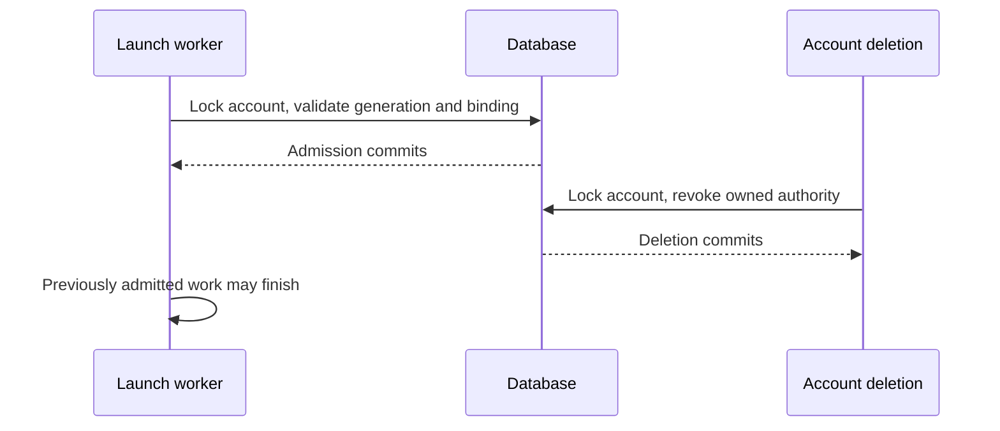

# Account deletion and authority revocation

After deletion succeeds, no new authentication, credentials, ownership, or
launch authorization can be granted to that account identity. Work admitted
before revocation may finish. Deletion is a database commit boundary; it does
not promise to kill an already running process or undo an external operation.

## Identity and saved authority

The username is a reusable display/login name. A random account generation
identifies one registration. Deletion retains a users-table tombstone, clears
its password and admin flag, and hides it from account/permission lookups.
Re-registration assigns a fresh generation.

Accounts JWTs carry that generation. Every authentication reads the account's
current generation and deletion status, including on other replicas; accounts
identity caching cannot extend access. Device and refresh grants, magic links,
scheduled tasks, and hosts retain their owner's generation. An explicitly saved
null generation means an external identity; it cannot acquire a subsequently
registered account's authority.

Session-permission cache keys include the authenticated generation. A new
registration cannot reuse another replica's old member or administrator cache
entry. Task listing, individual task access, and run-history access also check
the saved generation before returning private data.

Account authority travels with requests and work:

- Authenticated requests capture it in a workspace-scoped `ContextVar`.
- Async tasks and `asyncio.to_thread` inherit it.
- Durable scheduled work restores its saved generation.
- Context changes made inside a worker do not flow back to its caller.

Runner token issuance therefore resolves ownership, validates authority, and
mints the token within the same scoped worker and transaction:

1. Read the persisted host and session ownership. These owners may differ after
   an authorized admin launch.
2. Lock both accounts in username order and verify their captured generations.
3. Recheck the host/session/runner/owner binding under those locks.
4. Mint the token for the session owner.

Deletion of either owner prevents fresh issuance.

Operations on another user capture that target's generation before reading its
permissions or changing its password. A separate target scope carries the
snapshot through worker calls without replacing the acting identity. Writers
validate both under the ordered account locks; a target that was absent also
cannot silently become a new accounts registration between lookup and write.
A deleted/replaced target returns a conflict (409); an invalid actor still
returns unauthorized (401), including when both registrations have changed.

OIDC/header identities and scoped machine-principal tokens retain their own
lifecycle. The single-user local identity continues to work without an accounts
registration.

## Transaction ordering

Authority writes follow this order within one transaction:

1. Lock account rows in username order, including the actor, targets, and any
   related resource owners. Account deletion locks the full
   administrator/actor/target set.
2. Validate captured generations under those locks. Account deletion also
   enforces the last-admin invariant before changing resources.
3. Lock and update grants, hosts, or other resources while retaining the account
   locks.

Checking generations under the locks prevents a request authenticated earlier
from writing authority into a replacement account.

Database handling differs:

- **PostgreSQL:** use locking reads.
- **SQLite:** use immediate write transactions.
- **MySQL:** use locking reads and retry deadlock victims by replaying the entire
  rolled-back transaction with bounded backoff. This includes concurrent first
  writes that contend on missing rows.

Deletion removes session permissions, saved provider connections, projects,
project ordering, daily spending/approved budget checkpoints, and outstanding
invitations/magic links created for or by the user. It disables scheduled tasks
and revokes device/refresh grants. Session history remains, with project/host
bindings detached where required. A reused username does not inherit those
permissions, credentials, or projects.

Account deletion and ordinary host deletion share one host-cleanup operation.
Host rows are locked before cleanup, preventing a concurrent dormant-sandbox
replacement from escaping between bulk statements. Launch credentials are
cleared. Managed-host tombstones preserve pending sandbox IDs until the existing
provider cleanup worker confirms termination. Provider destruction happens
outside the account transaction; failures leave cleanup retriable.
Registration failures after provisioning also attempt to terminate the new
sandbox. An ID already retained for active work or pending cleanup remains under
the existing host lifecycle.

## Launch admission

All host launches pass a final database admission check immediately before
runner binding and launch-frame dispatch. It locks the account, checks the
connection's saved generation, then validates the live host and session-host
binding. A scheduled task's earlier host resolution is not launch admission.

An explicit host transfer first authorizes the caller against the destination
host and the session. Final admission also accepts the source host binding
captured by that resolution: Switch Host and CLI resume clear the runner while
retaining that binding. A move to an unrelated host in the meantime invalidates
the snapshot. Initial launches may admit an unbound session; automatic restarts
still require the destination binding. The conditional runner write prevents
overwriting a runner claimed by another launch.



If deletion commits first, admission fails and no launch frame is queued. If
admission commits first, dispatch may complete afterward. This makes the race
well-defined without holding a database transaction across a network operation.
A running runner must still obtain fresh authority for new owner credentials;
its binding token cannot mint for a deleted or re-registered identity.

## Migration and deployment

The migration assigns generations to existing password-bearing users and
backfills their saved authority. Existing credentials behave as follows:

- **Valid refresh grants:** retain their secrets and can renew into
  generation-bearing JWTs.
- **Ordinary cookies/JWTs:** lack the generation claim and require login again.
- **OAuth connection handshakes:** should be restarted after upgrade.

Schema changes handle database differences:

- **All databases:** check for existing columns before adding them.
- **CockroachDB:** commit new columns before reading them for backfill. The
  upgrade can resume after an interruption between schema commit and backfill.
- **MySQL:** individual `ALTER TABLE` statements commit even if the upgrade
  later fails. Checking for existing columns allows the upgrade to resume.

Accounts-mode deployments require a coordinated stop/upgrade/start of every
server and scheduler sharing the database. Mixed old/new versions are unsafe:
old code ignores tombstones and generations.

1. Back up the database.
2. Stop all writers, including every server and scheduler sharing the database.
3. Upgrade the application and run the migration.
4. Restart only the new version.
5. Log in again with ordinary browser sessions and restart any OAuth connection
   handshakes that began before the upgrade.

Do not roll back to old code against the new schema. Downgrade removes account
tombstones so old code cannot interpret them as active passwordless users; it
does not undo external cleanup or restore removed authority.

## Verification

Run the revocation HTTP/store/migration tests and the real two-server startup
check from the candidate checkout:

```sh
uv run --no-sync pytest tests/server/test_account_revocation.py tests/stores/test_account_revocation.py tests/db/test_migration_account_revocation.py tests/server/integration/test_account_revocation_processes.py -q
```

Run the store suite against PostgreSQL using `OMNIGENT_TEST_DB_URI` as well.
The launch tests use real orchestration, stores, and outbound frames with a
simulated host response. They do not start a runner process or an external
sandbox. The two-server test launches actual CLI subprocesses and sends HTTP
requests against shared SQLite. Neither test calls an LLM/provider or establishes
production rollout readiness.

For a human check on an isolated accounts deployment:

1. Log in as a non-admin in one browser profile and as admin in another.
2. Delete the non-admin account.
3. Verify that the first profile's next protected request requires login.
4. Register that username again.
5. Verify that the original cookie still fails and the replacement account can
   log in with no saved connections, projects, or session ownership.
